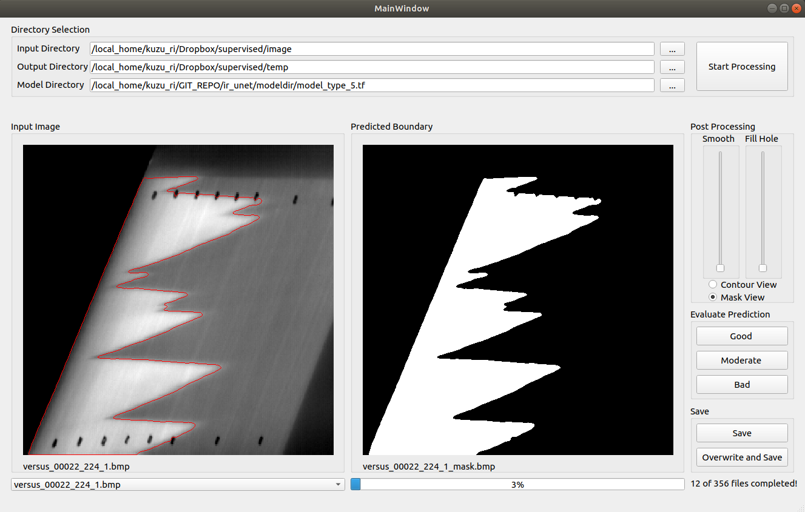
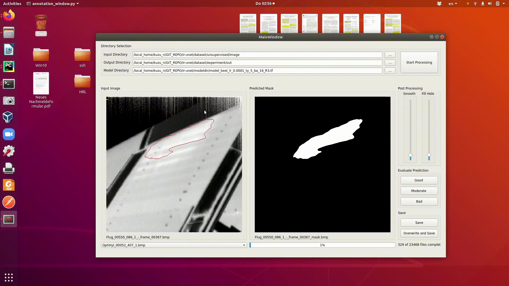

# Automatic Separation of Laminar-Turbulent Flows on Aircraft Wings and Stabilizers via Adaptive Attention Butterfly Network

## Main Objective of this Project
Laminar-Turbulent flow is a fluid dynamics phenomenon that refers to the motion  of particles as they move through a substance. The distinction between laminar and  turbulent flow is eminently important in aerodynamics and hydrodynamics because  the type of flow has a profound impact on how momentum and heat are transferred.

Specifically, detection of laminar and turbulent flow regions and transition locations in between are of crucial interest in a range of aviational applications, since
the achievement of a fuel-efficient wing, airfoil or rotor blade design and reducing
the instability caused by drag forces are strongly related with the way of handling
laminar and turbulent flow exposed by the wing and blade surfaces. 

As seen in Figure 1, the step 4 in the aircraft body component design workflow is the expert investigation to 
determine the laminar-turbulent regions on the measurement images. However, those investigations might be
entirely manual, or semi-automatic.  That is why, **The main objective of this project is to provide a reliable automation method for facilitating the localisation
of laminar-turbulent flow regions by using recent artificial intelligence approaches** 

<div class="center">
<figure>
<p align="center">


</p>
</figure>
<p align="center">
<strong style="color: orange; opacity: 0.80;">
Figure 1: High-level workflow for building new wings, stabilizers or blades (Please note that the workflow
ignores some of the side steps which are out of context for this work).</strong>
</p>
</div>

&nbsp;
<br />


# 1. Installation
WARNING: This project works best with Python 3.8
## 1.a. Preparing the Training Environment
For preparing the installation environment, there are two different options:
1. OPTION: conda environment can be built by installing the dependencies listed in [docker/requirements.txt](docker/requirements.txt)
   ```sh
   $ cd ir-unet/docker
   $ pip install -r requirements.txt
   ```
2. OPTION: docker environment can be built by running the following commands:
   ```sh
   $ cd ir-unet/docker
   $ docker build -t tensor_image .
   ```
## 1.b. Preparing the User Interface for Labelling

As you can see below, there is a user interface called _Annotation Window_ which can be used to handle checking the quality of the predicted labels and to make some postprocessing for removing artifacts or holes in the predicted label:


In order to prepare this user interface, there are two different options:

1. OPTION: The following commands can be used directly to run the python file:
   ```sh
    $ cd ir-unet
    $ python -m ui.annotation_window
   ```
2. OPTION: An executable file can be generated and utilized independently with the following command:
   ```sh
   $ cd ir-unet/ui
   $ pyinstaller  --onefile  annotation_window.py --hidden-import 'skimage.filters.rank.core_cy_3d'
   ```
   This command creates an executable file [dist/annotation_window.exe](dist/annotation_window.exe)  which can launch the user interface.

# 2. Training and Evaluation
For training and evaluation there are multiple options as described below:
1. A supervised model for the binary segmentation can be directly trained if there exist sufficient number of input and mask images for training.
2. If the labelled data is not sufficient for model generalization, causing overfitting or high bias & variance between training and validation:
   1. A self-supervised model can be trained on the unlabelled data, as a first step,
   2. Later, this self-supervised model can be fine-tuned on the labelled data.
   
Those procedures will be detailed below:


## 2.a. Supervised Learning
1. OPTION: [general/main.py](general/main.py) script can be called for training as illustrated in the following command:
   ```sh
   $ cd ir-unet
   $ python -m general.main  --learning-rate 0.000025 --batch-size 64 --num-augment 8 --out-dir modeldir/supervised/ --pair-csv dataset/supervised/fileNames.txt --model-type 6 --data-dir dataset/supervised/image/ --label-dir dataset/supervised/mask/
   ```
   As seen in the command, there are many arguments to be passed into the _main.py_ script, the definitions of these arguments are as follows:
   * __BATCH_SIZE__: number of batches; e.g. 32 and 64 are recommended as batch size
   * __CUDA__: index of GPU sources; e.g. _--cuda '0' _ for single GPU or _--cuda '1,2,3'_  for three different GPUs
   * __NUM_WORKERS__: number of workers for loading the training data; default:2 and no need to change in most cases
   * __NUM_EPOCHS__: number of epochs in training; default:180 and no need to change in most cases
   * __START_EPOCH__: epoch index for resuming the training; default:0 which means the training starts from scratch
   * __LEARNING_RATE__: learning rate of the optimizer selected for the training
   * __NUM_CLASSES__: number of classes in segmentation; default:2 and other options are not supported for now
   * __NUM_AUGMENT__: number of augmentation; e.g. _--num-augment 8_ is sufficient for standard supervised learning if the data size is less than 500
   * __MODEL_TYPE__: model architecture index; 0: MobileUNet, 1: UNet, 2: ResUNet, 3:AttentionUNet with ResNet, 4:AttentionUNet with EfficientNet-B0, 5:AttentionUNet with EfficientNet-B7, 6:Attention UNet without backbone
   * __DATA_DIR__: directory for input images; e.g. _--data-dir 'dataset/supervised/image/'_
   * __LABEL_DIR__: directory for input labels; e.g. _--data-dir 'dataset/supervised/mask/'_ 
   * __PAIR_CSV__: it is a pair list of input and label images; e.g. _--pair-csv 'dataset/supervised/fileNames.txt'_ , it is mandatory for supervised learning
   * __WEIGHT_FILE__: a weights file for the model initialization with pretrained weights; it should be _--weights 'None'_ for standard supervised training
   * __OUT_DIR__: directory for the trained output models with _'.tf'_ extension
   * __LOG_FILE__: a path to the log file to store the training, validation and test results for each run; default:_'performance-logs.csv'_  
   * __EVALUATE__: if it is True, only model evaluataion is run
   * __SELF_SUPERVISED__: it determines if training mode is supervised or self-supervised; FALSE for standard supervised learning
   * __SELF_RECONSTRUCT__: it determines if self-supervised learning is based on SimCLR or same-input reconstruction; FALSE for standard supervised learning
   * __TEMPERATURE__: it is a self-supervised learning parameter for cost calculation, not used in the standard supervised learning
   

2. OPTION: [general/main.py](general/main.py) script can be called in a bash file as can be seen in [_script_train_supervised.bat](_script_train_supervised.bat):
   ```sh
   $ cd ir-unet
   $ bash _script_train_supervised.bat
   ``` 
   Here, please check if the parameters in the bash file are relevant for your run.


3. OPTION: If you configured the Docker environment, you can also call the above mentioned scripts inside the Docker as similar to the following example:
   ```sh
   $ sudo docker run -it --init --rm --shm-size=32772m --gpus '"device=1,2,3,4"' -v "/<YOUR-HOME-DIR>/ir-unet/:/app" tensor_image bash _script_train_supervised.bat
   ```
   or
   ```sh
   $ sudo docker run -it --init --rm --shm-size=32772m --gpus '"device=1,2,3,4"' -v "/<YOUR-HOME-DIR>/ir-unet/:/app" tensor_image python -m general.main  --learning-rate 0.000025 --batch-size 64 --num-augment 8 --out-dir modeldir/supervised/ --pair-csv dataset/supervised/fileNames.txt --model-type 6 --data-dir dataset/supervised/image/ --label-dir dataset/supervised/mask/
   ```
  
## 2.b. Self-supervised Learning and Supervised Fine-tuning

The aim of the self-supervised learning is to mitigate the lack of labelled data. In case of sufficient number of labelled data, this step is not necessary. However, when there is an overfitting issue or similars due to the lack of data, this approach benefits from:
1. either self-supervised learning based on SimCLR approach as illustrated here: ,
2. or self-supervised learning based on reconstruction of same image at the output.

After the self-supervised learning on the unlabelled data, fine-tuning is made with the labelled data. The details of these steps are as follows:

### 2.b.i. Self-supervised Learning
Some reminders for the parameters of self-supervised learning:
* __DATA_DIR__ and __LABEL_DIR__ should be the same directory, because the data does not have labels
* __PAIR_CSV__ should be 'None'
* __SELF_SUPERVISED__ should be TRUE
* __SELF_RECONSTRUCT__ should be TRUE for self-supervised learning based on reconstruction, FALSE for self-supervised learning based on SimCLR
* __TEMPERATURE__ can be set to any positive float; default:1.0
* __NUM_AUGMENT__: can be set to 1, since the total number of unlabelled data is already huge

Considering those parameters, a sample call for the self-supervised learning is as follows:
   ```sh
   $ python -m general.main  --model-type 6 --temperature 0.01 --learning-rate 0.000100 --batch-size 64 --num-epochs 120 --num-augment 1 --self-supervised --out-dir modeldir/unsupervised/ --data-dir dataset/unsupervised/image/ --label-dir dataset/unsupervised/image/
   ```
   or, in case of Docker usage:
   ```sh
   $ sudo docker run -it --init --rm --shm-size=32772m --gpus '"device=1,2,3,4"' -v "/<YOUR-HOME-DIR>/ir-unet/:/app" tensor_image python -m general.main  --model-type 6 --temperature 0.01 --learning-rate 0.000100 --batch-size 64 --num-epochs 120 --num-augment 1 --self-supervised --out-dir modeldir/unsupervised/ --data-dir dataset/unsupervised/image/ --label-dir dataset/unsupervised/image/
   ```
### 2.b.ii. Supervised Fine-tuning
The fine-tuning followed by self-supervised learning should be done as follows:

1. Set the parameters for standard supervised learning as explained in Section _2.a Supervised Learning_. However, consider the following parameters:
* __WEIGHT_FILE__: should be the model directory created by self-supervised learning, e.g. _'--weight-file modeldir/unsupervised/model_best_lr_5e-05_ty_6_ba_64.tf'_
* __SELF_SUPERVISED__: it should be FALSE in fine-tuning
* __SELF_RECONSTRUCT__: FALSE if the WEIGHTS are based on SimCLR approach, TRUE if the weights are based on reconstruction of same image at the output

Thus, a sample call for fine-tuning on the labelled data:
```sh
   $ python -m general.main  --learning-rate 0.000025 --batch-size 64 --num-augment 8 --out-dir modeldir/supervised/ --pair-csv dataset/supervised/fileNames.txt --model-type 6 --data-dir dataset/supervised/image/ --label-dir dataset/supervised/mask/ --weight-file modeldir/unsupervised/model_best_lr_5e-05_ty_6_ba_64.tf
   ```
   or, in case of Docker usage:
   ```sh
   $ sudo docker run -it --init --rm --shm-size=32772m --gpus '"device=1,2,3,4"' -v "/<YOUR-HOME-DIR>/ir-unet/:/app" tensor_image python -m general.main  --learning-rate 0.000025 --batch-size 64 --num-augment 8 --out-dir modeldir/supervised/ --pair-csv dataset/supervised/fileNames.txt --model-type 6 --data-dir dataset/supervised/image/ --label-dir dataset/supervised/mask/ --weight-file modeldir/unsupervised/model_best_lr_5e-05_ty_6_ba_64.tf

   ```

## 2.c. Standalone Evaluation on Terminal
Sometimes there may be a need for evaluating the output of single input image, or outputs of images in a directory. In this case, the following command-line call can be useful:
  ```sh
   $ python -m general.evaluate  --input-dir dataset/supervised/image  --label-dir dataset/supervised/mask/ --out-dir dataset/supervised/predicted_supervised --weight-file modeldir/unsupervised/model_best_lr_5e-05_ty_6_ba_64.tf
   ```
Here, the parameters have the following roles:
* __INPUT_DIR__: path to the input image folder or image file
* __LABEL_DIR__: path to the input label folder or label file
* __OUT_DIR__: path to the output image folder or image file
* __WEIGHT_FILE__: a weights file for the model initialization with pretrained weights; it should NOT be _--weights 'None'_ 
* __SELF_SUPERVISED__: it determines if evaluation mode is for supervised or self-supervised learning; FALSE for supervised learning

## 2.d. Evaluation via Annotation Window

Annotation window can be launched with the following command directly inside Python:
   ```sh
    $ cd ir-unet
    $ python -m ui.annotation_window
   ```
or it can be run via the generated executable: 
   ```sh
    $ cd ir-unet/ui/dist/
    $ annotation_window.exe
   ```
Thus, following screen will be opened with those commands:



In this interface:
* __Input Directory__ is the directory where the images to be segmented are located
* __Output Directory__ is the output directory where the predicted mask will be saved
* __Model Directory__ is _'.tf'_ formatted tensorflow model obtained after standard supervised learning or supervised fine-tuning. If you do not have your trained model, you can use [modeldir/model_type_5.tf](modeldir/model_type_5.tf)

When those directories are defined, __Start Processing__ button should be clicked to run the process. After that, evaluation of the prediction quality or post-processing of the predicted masks can be possible as illustrated in the video above.

# 3. Editing Annotation Window UI
The UI can be edited or updated via _QT Designer_ if requred in certain circumstances, such as adding new functionalities to the UI. To do this:

1. Install _QT Designer_:
    ```sh
    $ pip install PyQt5Designer
   ```
   
2. Run _QT Designer_:
    ```sh
    $ sudo designer
   ```
3. On the opened editing tool, you can load [ui/gui.ui](ui/gui.ui) file to see the drag-drop functionalities of the existing interface
4. There, you can edit [ui/gui.ui](ui/gui.ui) file and save it again with updated buttons, labels, components, etc.
5. And finally the new Annotation Window can be compiled with the following command:
   ```sh
    $ cd ir-unet/ui
    $ sudo pyuic5 "gui.ui" -o "gui.py"
   ```
6. After those steps, do not forget to check compatibility of [ui/gui.py](ui/gui.py) with [ui/annotation_window.py](ui/annotation_window.py).
